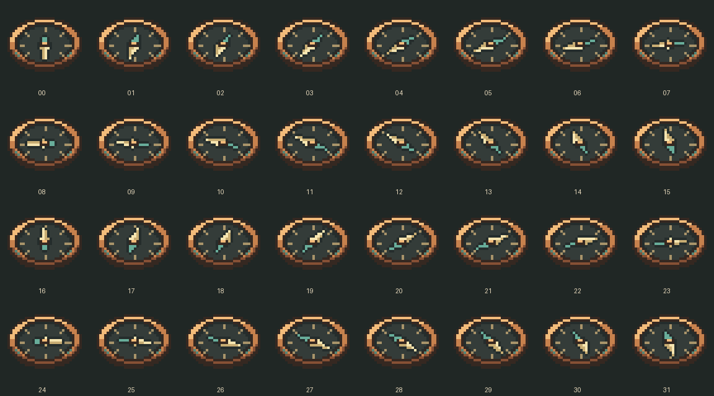

# 考古罗盘（Archaeology Compass）

面向 NeoForge、Minecraft `1.21.1` 的考古定位模组。

考古罗盘会在已加载区块中寻找可考古方块，并像原版指南针一样指向最近有效目标。找不到目标时，指针持续旋转。

## 功能

- 默认定位仍有未刷出战利品的可疑沙子和可疑沙砾。
- 指向扫描范围内最近有效目标。
- 目标被刷空、挖掘、超出范围或切换维度后自动失效并重新搜索。
- 仅搜索已加载区块，不会为扫描强制加载区块。
- 扫描半径、垂直范围和扫描间隔可由服务端配置。
- 使用数据包方块标签扩展目标方块，便于整合包和其他模组兼容。
- 支持独立服务端与多人联机；服务端负责搜索和目标判定，客户端仅显示指针。

## 美术表现

考古罗盘采用原创 **32×32 像素贴图**，以铜制考古仪器为主题：铜色双层边框、镂空挂环、铆钉与氧化铜点缀，搭配深色表盘和 16 个方向刻度。

浅金色长针指向目标，绿色短尾用于区分方向。模型根据指针角度选择 **32 帧**贴图；无目标时持续旋转，保留原有定位逻辑。

### 旋转预览


此动画用于展示各角度的美术效果，不是游戏截图；播放速度不代表游戏内指针转速。

### 全帧预览



如需调整配色或细节，可修改 `generate_compass_assets.py` 后重新生成贴图、帧模型和预览图。脚本需要 Python 3 与 Pillow：

```bat
py -3 -m pip install Pillow
py -3 generate_compass_assets.py
```

游戏内手持与物品栏的视觉效果尚待验证。

## 支持版本

首发目标：

- Minecraft `1.21.1`
- NeoForge：使用工程 `gradle.properties` 中声明的兼容版本
- Java `21`

后续 Minecraft 版本会独立构建、测试和发布，不使用同一个 JAR 跨版本运行。

## 开发

```bat
gradlew.bat runClient
gradlew.bat runServer
gradlew.bat build
```

构建产物位于 `build/libs/`。

## 文档

完整需求、架构、性能、联机同步与发布规范见：[开发文档](docs/NeoForge_MC模组开发文档.md)。

## 许可

许可证待定。发布前请在 `LICENSE` 中明确许可证文本。
